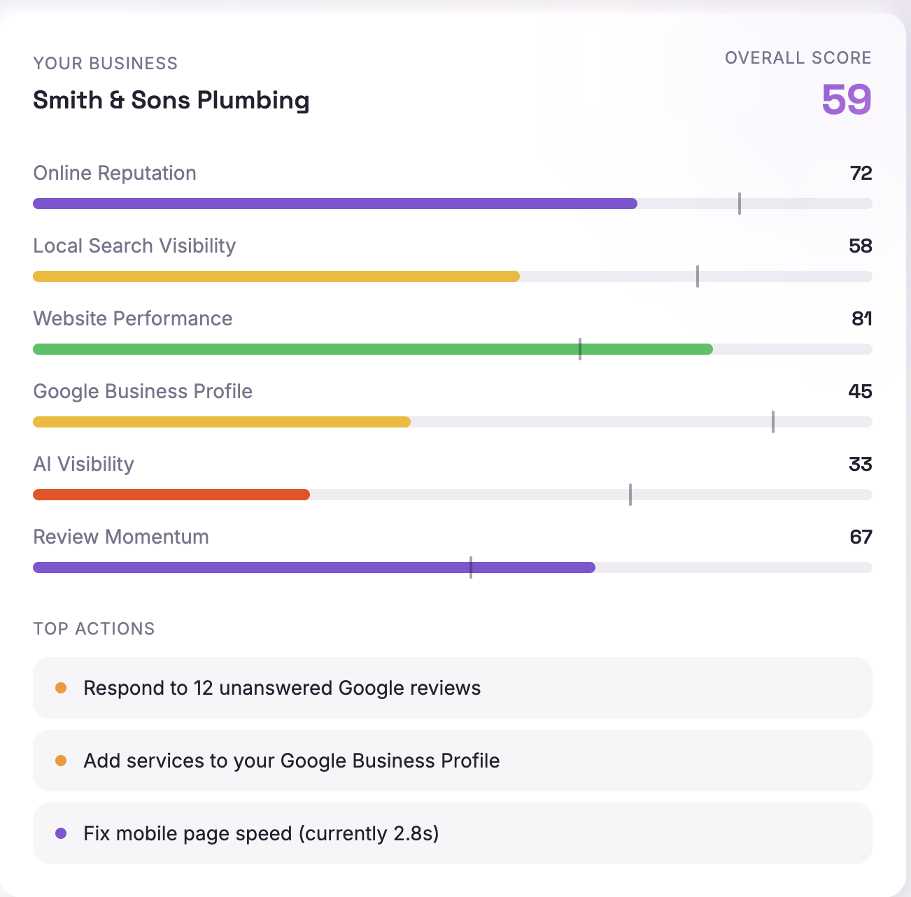

<p align="center">
  
</p>

<h1 align="center">Scoutly</h1>

<p align="center">
  <strong>Local SEO for small businesses, minus the jargon.</strong><br />
  <em>Sniffs out what the competition is up to. Never asks for a treat.</em>
</p>

Scoutly keeps an eye on your business and up to five local rivals, scores everyone on the stuff that actually gets you found on Google, and hands you a short weekly to-do list. Think of it as a friend who works in SEO and checks in every Monday with "here's how you did, here's what to fix, go get 'em."



---

## Who it's for

You run a dental practice, a gym, a driving school, a salon, a plumbing business. You know "showing up on Google" matters. You don't have time to learn what a schema markup is, and you definitely don't have £2,000 a month for an agency that sends you a PDF you never open.

Scoutly is for you.

## What it does

### 1. Scouts your competitors so you don't have to

Every project has **one business (yours)** and **up to five competitors**. Scoutly crawls each website with a real browser, grabs Google Business Profile data, checks where everyone ranks for the searches that matter, and reads the reviews. Then it does it all again every week, so you see who's climbing and who's coasting.

### 2. Scores six things that move the needle

| What we score               | What we're looking at                                                                        | Why you should care                                                           |
| --------------------------- | -------------------------------------------------------------------------------------------- | ----------------------------------------------------------------------------- |
| **Online Reputation**       | Star rating, review count, how often you reply                                               | It's the first thing a customer compares. You know it. They know it.          |
| **Local Search Visibility** | Where you land in the map pack and search results for your services                          | Page two of Google is where businesses go to hide.                            |
| **Website Performance**     | Speed, mobile-friendliness, titles, headings, broken pages, schema                           | Google won't send people to a site that makes them wait.                      |
| **Google Business Profile** | Hours, categories, photos, services, description, posts                                      | A half-finished profile loses to a full one, even with worse reviews. Really. |
| **AI Visibility**           | Whether ChatGPT, Gemini and friends mention you when someone asks for a local recommendation | More people are asking a chatbot instead of Googling. Be in the answer.       |
| **Review Momentum**         | New reviews per month, versus your competitors                                               | Google likes a steady trickle of fresh reviews more than a big old pile.      |

Each one gets a score from 0 to 100. They roll up into a single **health score** so you can tell at a glance whether you're winning, level, or getting lapped.

### 3. Sends you a weekly scorecard

Once a week, in the app and in your inbox, Scoutly answers three questions:

- **Where do I stand?** Your score next to each competitor, with what changed since last week.
- **What happened?** Competitor moves worth knowing about. We filter out the noise so you only hear about the real stuff.
- **What do I do now?** Three to five ranked actions, each with a plain-English "why" and a rough idea of how long it'll take.

Here's what that looks like for Smith & Sons Plumbing, the business in the screenshot above:

```
Overall score            59  (+4 this week)   You're #3 of 5 locally. Climbing.

Online Reputation        72   ▲ 3   Solid, but you're leaving reviews unanswered
Local Search Visibility  58   ▲ 6   Moved from #6 to #4 for "plumber near me"
Website Performance      81   —     Best in the group. Keep it that way.
Google Business Profile  45   ▲ 2   Your weak spot. Easy wins here.
AI Visibility            33   —     1 of 3 assistants mentions you
Review Momentum          67   ▲ 5   6 new reviews vs. a group average of 4

Heads up: Rapid Rooter added an "Emergency Callouts" page and
now outranks you for "emergency plumber [town]".
```

### 4. Tells you exactly what to fix

Actions come from the gaps in your scores and what we found on your site. They're ranked by how much they'll help and how much effort they take. A few examples of what you might see:

- **Add your opening hours and a description to Google Business Profile.** Your profile is 60% complete. Your top rival's is 95%. This takes 15 minutes and you can do it on your phone.
- **Reply to your 14 unanswered reviews.** Competitors reply to 80% of theirs. A reply says "we're here and we care," and Google notices.
- **Your homepage takes 6.2 seconds to load on mobile.** Shrink the hero image and bin the chat widget nobody uses. An hour of work, or a quick ask to your web person.
- **Make a page for "emergency plumber [town]".** Two competitors rank for it. You don't have a page about it at all.
- **Your Contact page has no title.** It shows up in Google as "Untitled". Not a great look.
- **Add LocalBusiness schema markup.** Three of five rivals have it. It helps Google and AI assistants understand who you are and where you are.
- **Ask for reviews after every appointment.** You're getting two a month. The group average is seven. One follow-up text with a link closes that gap fast.
- **Add photos of your team and your place.** Profiles with 20+ photos get way more "get directions" taps than ones with five.

### 5. Taps you on the shoulder when a rival makes a move

Between scorecards, Scoutly flags the stuff worth knowing: a new service page, a burst of reviews, a rebrand, a second location, a rank change on a search you care about. Every alert is double-checked against a second crawl before you see it, so you're never chasing ghosts.

---

## Tech stack

Accurate to the pinned versions in `package.json`.

| Layer             | What we use                                                                                                                                                                      |
| ----------------- | -------------------------------------------------------------------------------------------------------------------------------------------------------------------------------- |
| Framework         | [Next.js 15](https://nextjs.org) (App Router, Server Actions, Turbopack dev)                                                                                                     |
| Language          | TypeScript 5.8, strict mode, no excuses                                                                                                                                          |
| UI                | React 18, [Tailwind CSS 3.4](https://tailwindcss.com), [shadcn/ui](https://ui.shadcn.com) on Radix primitives, Lucide icons, Framer Motion, Recharts                             |
| Design system     | Token-driven theme in `globals.css`. Inter for body, Space Grotesk for headings, violet primary, orange accent, soft neumorphic surfaces                                         |
| State and data    | Zustand 5, TanStack Query 5, React Hook Form + Zod                                                                                                                               |
| Database and auth | [Supabase](https://supabase.com) (Postgres, Row Level Security, Auth) via `@supabase/ssr`                                                                                        |
| Background jobs   | [Inngest 3](https://www.inngest.com) for crawl orchestration, retries, and cron scheduling                                                                                       |
| Crawling          | [Cloudflare Browser Rendering](https://developers.cloudflare.com/browser-rendering/). Full JS rendering with `networkidle0` on every single crawl                                |
| AI                | [Anthropic Claude](https://www.anthropic.com) via `@anthropic-ai/sdk` for health-score reasoning, priority actions, and change summaries. Strict JSON, under 200 tokens per call |
| Google data       | Google Places API, Google Business Profile OAuth, PageSpeed Insights                                                                                                             |
| Search data       | [SerpApi](https://serpapi.com) for local pack and organic rankings                                                                                                               |
| Email             | [Resend](https://resend.com) + [React Email](https://react.email) for the weekly digest                                                                                          |
| Testing           | Vitest 4                                                                                                                                                                         |
| Tooling           | Bun, ESLint 9 (flat config), Prettier 3, Husky + lint-staged                                                                                                                     |

Every third-party API call happens server-side. No keys ever reach the browser.

---

## Getting started

### 1. Install dependencies

```sh
bun install
```

### 2. Set up your environment

```sh
cp .env.example .env.local
```

| Variable                                    | Where to get it                                                     |
| ------------------------------------------- | ------------------------------------------------------------------- |
| `NEXT_PUBLIC_SUPABASE_URL`                  | Supabase dashboard → Project Settings                               |
| `NEXT_PUBLIC_SUPABASE_ANON_KEY`             | Supabase dashboard → Project Settings                               |
| `SUPABASE_SERVICE_ROLE_KEY`                 | Supabase dashboard → Project Settings (server only)                 |
| `NEXT_PUBLIC_APP_URL`                       | `http://localhost:3000` locally; your domain in production          |
| `CF_ACCOUNT_ID`                             | Cloudflare dashboard → account menu                                 |
| `CF_API_TOKEN`                              | Cloudflare → My Profile → API Tokens (Browser Rendering permission) |
| `ANTHROPIC_API_KEY`                         | console.anthropic.com                                               |
| `GOOGLE_PLACES_API_KEY`                     | Google Cloud Console                                                |
| `SERP_API_KEY`                              | serpapi.com                                                         |
| `RESEND_API_KEY` / `RESEND_FROM_EMAIL`      | resend.com/api-keys                                                 |
| `INNGEST_EVENT_KEY` / `INNGEST_SIGNING_KEY` | Inngest dashboard → your app                                        |
| `SITE_PASSWORD`                             | Anything you like. Gates the app during private beta                |

### 3. Seed Cloudflare credentials in Supabase

Cloudflare credentials live per user in the `app_settings` table:

```sql
insert into app_settings (user_id, cf_account_id, cf_api_token)
values ('<your-user-id>', '<cf-account-id>', '<cf-api-token>');
```

### 4. Run it

```sh
bun run dev:all
```

Use `bun run dev` if you're not touching Inngest functions. `dev:all` also spins up the Inngest dev server, which you need for crawls and background jobs to actually do anything.

---

## How the weekly cycle works

1. You add a business or hit **Re-scan**. That calls `POST /api/crawl` and fires a `crawl/business.scan` event.
2. Inngest picks it up and runs the crawl worker. It kicks off a Cloudflare Browser Rendering job, waits for it to finish, strips out cookie banners and bot-check pages, pulls the signals (titles, headings, links, schema, services), adds Google and SERP data on top, and saves everything to Supabase.
3. Scores are computed deterministically from that data. Claude only steps in to reason about the health score, write the actions, and summarise what changed.
4. Changes are held until a second crawl confirms them. Then they become alerts.
5. A daily health-check cron (08:00 UTC) rescues stuck crawls, logs success and failure rates, and re-queues any business that hasn't been crawled in seven days. It's the one and only scheduler. Nothing reschedules itself.

Crawl limits:

- Initial crawl: `maxDepth: 3`, `maxPages: 30`
- Incremental crawl: `maxDepth: 2`, `maxPages: 10`

Every crawl uses full JavaScript rendering with `waitUntil: 'networkidle0'` and a 30-second timeout. Plain HTML fetching is a last-resort fallback only. Most small-business sites are JavaScript-heavy these days and come back as empty shells without a real browser.

---

## Scripts

| Command                           | What it does                                        |
| --------------------------------- | --------------------------------------------------- |
| `bun run dev`                     | Next.js only (Turbopack)                            |
| `bun run dev:all`                 | Next.js plus the Inngest dev server                 |
| `bun run build`                   | Production build                                    |
| `bun run lint` / `lint:fix`       | ESLint                                              |
| `bun run format` / `format:check` | Prettier                                            |
| `bun run test` / `test:watch`     | Vitest unit tests                                   |
| `bun run test:unit`               | Vitest unit tests, single run (what CI runs)        |
| `bun run test:integration`        | AI pipeline integration test                        |
| `bun run test:e2e`                | Playwright end-to-end tests                         |
| `bun run typecheck`               | `tsc --noEmit`                                      |
| `bun run email:preview`           | Preview the weekly digest email at `localhost:3001` |

---

## CI

`.github/workflows/ci.yml` runs on every push to every branch: `lint` →
`typecheck` → `test:unit` → `build`, then Playwright. It builds with placeholder
Supabase keys, never real secrets — see the comments in the workflow for why.

**`main` requires CI to pass before merging.** That rule is not in this repo —
branch protection lives in GitHub settings and has to be turned on by hand:
Settings → Branches → add a rule for `main` → "Require status checks to pass
before merging" → select `check`.

---

## What's next

- Weekly digest email, sent on the crawl cycle
- Score history so you can see the trend, not just the snapshot
- Keyword tracking per project with rank history
- AI visibility checks across more assistants
- A shareable scorecard link you can send to your web developer with "can you do these three things?"

---

<p align="center">
  <br />
  <sub>Built by a fox with a clipboard.</sub>
</p>
